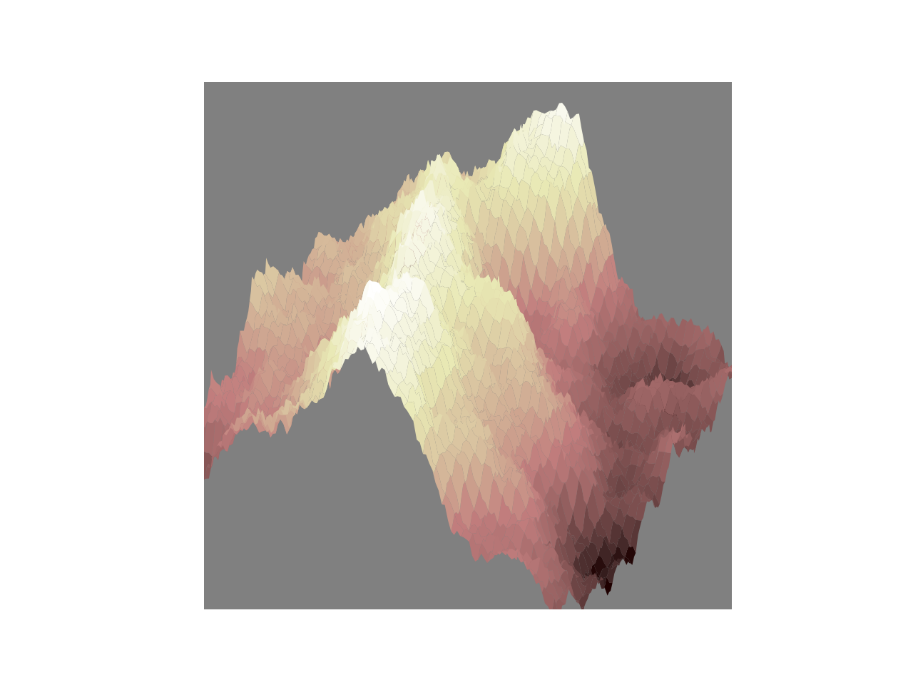

# Miscellaneous Projects:

In this repository, there are several pet projects I am working on, each in different files, named accordingly.
In chronological order:

- Mandelbrot & Julia Sets: (started 08/21; still in progress)

- Apollonian Gasket: (started 12/21; still in progress)

- Three Dimensional Shapes: (started 1/22; in progress)

- Fractal Landscapes: (started 1/22; in progress)

---

---

---

---

---

